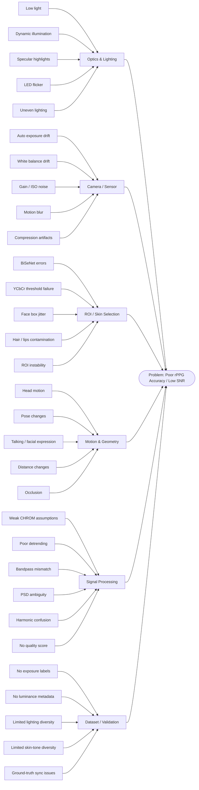

# rPPG SNR Fishbone Diagram — Why We Still Don’t Match Contact Sensors

This document organizes the **root causes of low signal-to-noise ratio (SNR)** in remote photoplethysmography (rPPG), with direct relevance to your current pipeline:

* Face detection / ROI extraction
* BiSeNet + YCbCr skin masking
* CHROM signal extraction
* Bandpass filtering + Welch PSD
* Harmonic correction
* Proposed luminance / illumination-aware extension

It is designed to help with:

* thesis framing
* paper motivation
* system design decisions
* future dataset design
* identifying what to log during experiments

---

# 1) Fishbone Diagram (Ishikawa)

```mermaid
flowchart LR
    A[Poor rPPG Accuracy / Low SNR / Weak Clinical Reliability]

    B1[Optics & Lighting]
    B2[Camera / Sensor Pipeline]
    B3[Subject / Physiology]
    B4[Face, Skin & ROI Extraction]
    B5[Motion & Geometry]
    B6[Signal Processing / Algorithm]
    B7[Dataset & Ground Truth]
    B8[Deployment / Real-Time Constraints]

    B1 --> A
    B2 --> A
    B3 --> A
    B4 --> A
    B5 --> A
    B6 --> A
    B7 --> A
    B8 --> A

    C11[Low light]
    C12[Harsh directional light]
    C13[Dynamic illumination]
    C14[Specular highlights]
    C15[Flicker / PWM LEDs]
    C16[Background light contamination]

    B1 --> C11
    B1 --> C12
    B1 --> C13
    B1 --> C14
    B1 --> C15
    B1 --> C16

    C21[Auto exposure instability]
    C22[Gain / ISO noise]
    C23[Motion blur]
    C24[Compression artifacts]
    C25[Rolling shutter]
    C26[White balance drift]
    C27[Color pipeline / tone mapping]
    C28[Low bit depth / quantization]

    B2 --> C21
    B2 --> C22
    B2 --> C23
    B2 --> C24
    B2 --> C25
    B2 --> C26
    B2 --> C27
    B2 --> C28

    C31[Skin tone / melanin variation]
    C32[Low perfusion]
    C33[High HR / exercise]
    C34[Respiration interference]
    C35[Facial hair / makeup / sweat]
    C36[Talking / blinking / expression]

    B3 --> C31
    B3 --> C32
    B3 --> C33
    B3 --> C34
    B3 --> C35
    B3 --> C36

    C41[Face detector jitter]
    C42[BiSeNet segmentation errors]
    C43[YCbCr threshold failure]
    C44[Non-skin leakage]
    C45[Bad ROI selection]
    C46[Mouth / eyes / beard contamination]

    B4 --> C41
    B4 --> C42
    B4 --> C43
    B4 --> C44
    B4 --> C45
    B4 --> C46

    C51[Head translation]
    C52[Head rotation / pose]
    C53[Distance changes]
    C54[Out-of-plane motion]
    C55[Occlusion]
    C56[Perspective deformation]

    B5 --> C51
    B5 --> C52
    B5 --> C53
    B5 --> C54
    B5 --> C55
    B5 --> C56

    C61[CHROM assumptions violated]
    C62[Weak detrending]
    C63[Bandpass too rigid]
    C64[Harmonic confusion]
    C65[PSD peak ambiguity]
    C66[No signal quality index]
    C67[Poor ROI fusion]

    B6 --> C61
    B6 --> C62
    B6 --> C63
    B6 --> C64
    B6 --> C65
    B6 --> C66
    B6 --> C67

    C71[Dataset mostly well-lit]
    C72[No exposure metadata]
    C73[No lux / luminance labels]
    C74[Weak skin tone diversity]
    C75[Limited motion / talking cases]
    C76[Ground truth sync errors]

    B7 --> C71
    B7 --> C72
    B7 --> C73
    B7 --> C74
    B7 --> C75
    B7 --> C76

    C81[30 fps limit]
    C82[On-device compute budget]
    C83[Dropped frames]
    C84[Thermal throttling]
    C85[Latency / buffering]
    C86[Unstable mobile environments]

    B8 --> C81
    B8 --> C82
    B8 --> C83
    B8 --> C84
    B8 --> C85
    B8 --> C86
```

---

# 2) Executive Summary

The reason rPPG still does **not consistently match invasive/contact sensors** is not because the pulse signal is absent.

It is because the **pulsatile optical signal is tiny**, and the camera pipeline introduces disturbances that are often **larger than the pulse itself**.

In simplified form:

[
I_{observed}(x,y,t) = I_{skin}(x,y,t) + I_{motion}(x,y,t) + I_{lighting}(x,y,t) + I_{sensor}(x,y,t) + I_{compression}(x,y,t)
]

The desired pulse component is buried inside a mixture of:

* motion artifacts
* illumination drift
* camera auto-adjustments
* segmentation mistakes
* skin optical variability
* temporal estimation uncertainty

So the central problem is:

> **Not just heart-rate estimation — but isolating a sub-percent physiological modulation from a visually unstable video stream.**

---

# 3) How this maps to your current pipeline

Your uploaded document already has a very solid **classical rPPG signal pipeline**:

* RGB / YCbCr handling
* BiSeNet + YCbCr skin mask
* CHROM extraction
* bandpass filtering
* Welch PSD
* harmonic correction

That gives you a strong “signal extraction backbone.” fileciteturn0file0L1-L15

But the biggest remaining gap is that the current pipeline mostly assumes:

* the right pixels are selected
* the light is acceptable
* exposure is stable enough
* the face signal is dominant enough

Those assumptions are exactly where real-world SNR collapses.

---

# 4) Root Cause Breakdown (Detailed)

## A. Optics & Lighting

## Why it matters

rPPG fundamentally depends on tiny reflectance changes caused by blood volume modulation. If the illumination field is poor or unstable, those changes get masked.

### Main disruptors

* **Low illumination** → insufficient photons, high sensor noise
* **Directional lighting** → one side of face overexposed, other underexposed
* **Dynamic lighting** → moving shadows, screen glow, sunlight changes
* **Specular reflection** → sweat / oily skin creates bright hotspots unrelated to pulse
* **LED flicker / PWM** → periodic intensity contamination
* **Background light contamination** → global brightness changes not tied to skin physiology

### Why this hurts SNR

The pulse is usually a **very small AC component** riding on a large DC baseline. If lighting fluctuates more strongly than blood-driven reflectance, the signal is buried.

### Your proposed fix here is excellent

This is exactly why your proposed:

* global frame luminance
* skin-only luminance
* ROI-level luminance
* temporal luminance stability

is so valuable.

This should absolutely be part of your system.

---

## B. Camera / Sensor Pipeline

This is one of the most underestimated failure sources.

### Main disruptors

* **Auto-exposure (AE)** changes frame brightness over time
* **Auto white balance (AWB)** changes RGB channel relationships
* **Auto gain / ISO** introduces noise
* **Motion blur** smears subtle skin variations
* **Rolling shutter** can distort temporal consistency
* **Image signal processor (ISP)** tone mapping changes apparent chrominance
* **Compression** destroys subtle pulse information
* **Low bit depth** limits tiny intensity variation detection

### Why it matters mathematically

Your observed channel signal is not just pulse:

[
C(t) = C_{baseline} + C_{pulse}(t) + C_{camera}(t) + C_{motion}(t)
]

If AE/AWB are changing over time, then even CHROM/POS are working on a moving target.

### Important implication for your work

You should log per-frame or per-second:

* exposure duration
* ISO / gain
* white balance temperature/tint (if available)
* frame luminance
* saturation ratio

That alone can become a publishable metadata-aware enhancement layer.

---

## C. Subject / Physiology

This is where camera-only methods face a harder reality than contact sensors.

### Main disruptors

* **Skin tone / melanin variation** changes optical penetration and reflectance balance
* **Low peripheral perfusion** reduces pulsatile amplitude
* **Exercise / high HR** broadens or shifts spectral energy
* **Respiration** modulates the signal envelope
* **Sweat / makeup / skincare products** alter reflectance
* **Facial hair** blocks usable skin pixels
* **Talking / blinking / expression** creates non-cardiac intensity variation

### Why this matters

Contact PPG has direct optical contact with tissue. rPPG has to infer physiology through:

* ambient light
* camera optics
* skin reflectance
* geometry

That is a much weaker observation model.

---

## D. Face, Skin & ROI Extraction

This is one of the most important categories for your specific work.

Your pipeline uses:

* YOLO face detection
* BiSeNet segmentation
* YCbCr filtering
* masked RGB extraction

This is exactly the right direction. fileciteturn0file0L13-L18

But it can still fail in multiple ways.

### Main disruptors

* face detector box jitter
* skin mask inconsistency across frames
* YCbCr thresholds not universal across skin tones / lighting
* inclusion of lips / beard / eyelids / eyebrows / hair
* exclusion of actually useful skin pixels
* ROI boundaries moving over time

### Why this hurts SNR

Even if CHROM is mathematically sound, **garbage in = garbage out**.

If the mask contains non-skin or unstable skin pixels, the extracted RGB time series is corrupted before any signal processing begins.

### Strong recommendation for your system

Move from a **single face-wide skin mask** to a **weighted ROI strategy**:

* forehead (highest weight)
* left cheek (high)
* right cheek (high)
* nose (medium)
* chin (low)
* periorbital / mouth / beard (exclude)

This is much stronger than “all skin is equally useful.”

---

## E. Motion & Geometry

This is probably the biggest practical reason rPPG fails outside the lab.

### Main disruptors

* head translation
* head rotation
* pose change
* out-of-plane motion
* distance changes
* partial occlusion
* facial deformation during talking

### Why this is hard

rPPG assumes that the same physiological skin region is being observed consistently over time.

Motion breaks that assumption.

Instead of tracking pulse from one optical surface, you end up mixing:

* different skin patches
* different angles
* different specular conditions
* different shading patterns

### Strong implication

Your system should explicitly track:

* ROI motion magnitude
* face area change
* landmark displacement
* ROI visibility confidence

These should be part of your quality score.

---

## F. Signal Processing / Algorithmic Assumptions

Your current pipeline is good — but classical pipelines have limitations.

### In your document, the main algorithm is CHROM.

That is a valid and respected baseline. fileciteturn0file0L7-L12

### But CHROM assumes

* illumination behaves in a roughly predictable way
* specular disturbances can be suppressed chromatically
* the extracted RGB means represent stable skin reflectance

That is often violated in real-world use.

### Common algorithmic SNR disruptors

* CHROM / POS assumptions break under dynamic lighting
* poor detrending leaves slow drift
* fixed bandpass misses edge cases
* Welch PSD can confuse harmonics or motion peaks
* low SNR produces multiple plausible spectral peaks
* no frame-level signal quality index (SQI)
* naive averaging across ROIs can mix strong + weak regions

### Strong recommendation

Instead of one final pulse estimate, compute:

1. **ROI-specific pulse candidates**
2. **ROI-specific quality scores**
3. **weighted fusion**

That will improve robustness a lot.

---

## G. Dataset & Ground Truth Limitations

This is a huge bottleneck in rPPG research.

### Why most models look better in papers than in reality

Because many public datasets are:

* well-lit
* short-duration
* mostly frontal face
* low motion
* limited skin-tone diversity
* weakly annotated for camera metadata

### Common dataset gaps

* no lux measurement
* no exposure metadata
* no white balance logs
* no per-frame luminance labels
* no ROI-specific skin masks
* no face-quality labels
* no talking / chewing / device-use realism

### Why this matters for your work

Your proposed luminance-aware logging could directly fill a **real dataset gap**.

That is actually one of the most valuable contributions you can make.

---

## H. Deployment / Real-Time Constraints

Even if the method is theoretically good, real-time deployment adds failure modes.

### Main disruptors

* 30 fps may be adequate, but not generous under motion
* frame drops distort temporal analysis
* mobile CPU/GPU limits reduce segmentation quality or rate
* thermal throttling causes inconsistent processing
* latency / buffering can desynchronize estimates
* real users do not sit still under ideal light

### Important engineering takeaway

A robust system must not only estimate HR.
It must also know:

> **“Should I trust this estimate right now?”**

That is where your luminance / ROI quality framework becomes very valuable.

---

# 5) Why Contact Sensors Still Win

This is the fundamental comparison.

## Contact PPG / invasive systems have major advantages:

* fixed optical geometry
* controlled emitter wavelength
* controlled detector distance
* strong coupling to tissue
* minimal ambient light interference
* high SNR by design

## rPPG has to infer the same physiology through:

* uncontrolled ambient illumination
* consumer camera ISP
* motion
* skin variability
* compression
* imperfect segmentation

So the real question is not:

> “Why is rPPG worse?”

It is:

> “How can we systematically reduce each non-physiological disturbance until the pulse becomes dominant?”

That is the right research framing.

---

# 6) What You Should Add to Your Current Pipeline

Here is the strongest next-step architecture for your system.

## Add a “Signal Quality Layer” before CHROM / after ROI extraction

### Per-frame or per-second features to log:

### Global scene quality

* frame luminance mean (Y plane)
* frame luminance std
* saturation ratio
* dark pixel ratio

### Face quality

* face luminance mean
* face luminance std
* face area / distance proxy
* pose angle
* landmark stability

### ROI quality

* forehead luminance mean
* cheek luminance mean
* ROI temporal stability
* ROI visibility percentage
* ROI specular highlight percentage
* ROI motion score

### Camera metadata

* exposure duration
* ISO / gain
* white balance (if accessible)
* fps stability
* dropped frames

### Signal-level quality

* CHROM/POS band power ratio
* peak sharpness in PSD
* harmonic consistency
* inter-ROI HR agreement

This becomes your **quality-aware rPPG stack**.

---

# 7) Research Question You Can Actually Publish

A very strong thesis / paper framing would be:

## Title direction

**“A Luminance-Aware, ROI-Weighted Signal Quality Framework for Robust Real-Time Remote Photoplethysmography”**

### Core hypothesis

rPPG failure is not just caused by poor pulse extraction.
It is caused by insufficient modeling of:

* illumination quality
* ROI quality
* motion contamination
* camera adaptation behavior

### Your contribution

You are proposing to model these disturbances explicitly instead of hoping CHROM or a deep network magically absorbs them.

That is a much stronger systems paper.

---

# 8) Most Important Takeaway

If you want to improve rPPG toward clinical-grade reliability, the path is not just:

* “better HR estimation”

It is:

* **better optical observability**
* **better pixel selection**
* **better disturbance measurement**
* **better confidence estimation**

That is exactly what your luminance + skin ROI idea is doing.

And that is why it is worth pursuing seriously.

