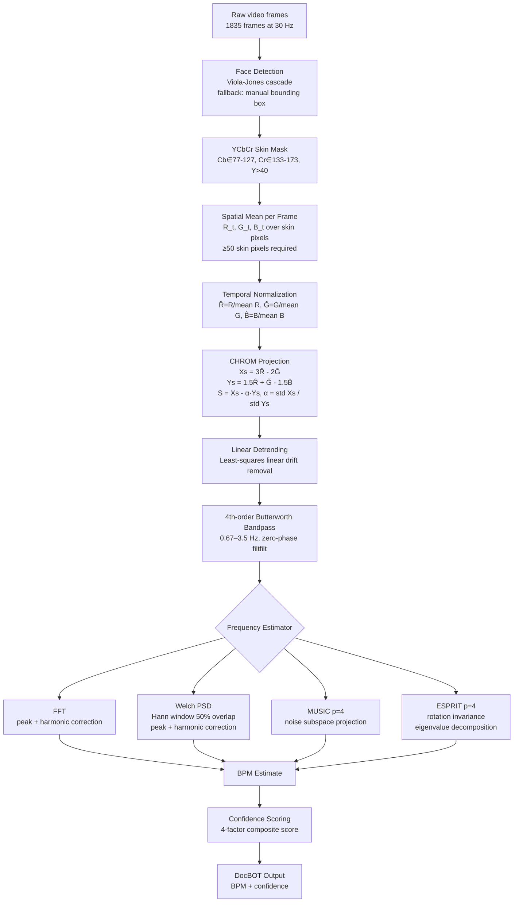
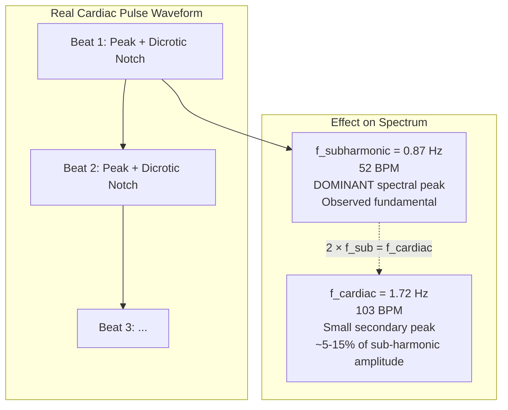
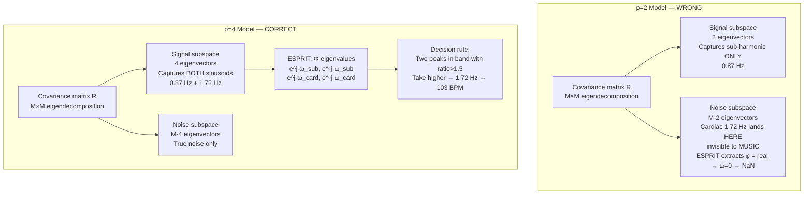
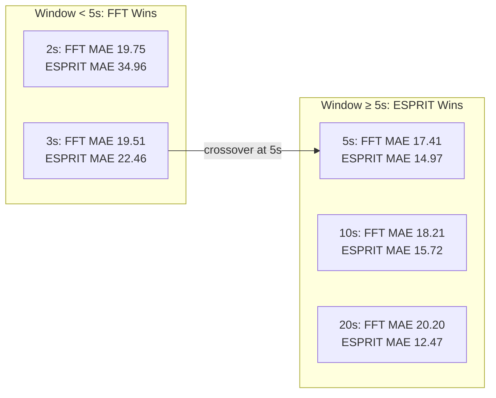

# rPPG Frequency Estimation: FDA, MUSIC, and ESPRIT Investigation
## Technical Report — DocBOT Project, MACS Lab, University of Washington

**Author:** Devansh Bajwala  
**Principal Investigator:** Prof. Xu Chen  
**Date:** June 23, 2026  
**Repository:** `rPPG-Controls`

---

## Table of Contents

1. [Introduction and Scope](#1-introduction-and-scope)
2. [rPPG Signal Pipeline](#2-rpppg-signal-pipeline)
3. [Experimental Setup](#3-experimental-setup)
4. [The Sub-Harmonic Artifact Problem](#4-the-sub-harmonic-artifact-problem)
5. [Harmonic Correction — FFT/Welch Tuning](#5-harmonic-correction--fftwelch-tuning)
6. [Subspace Methods: MUSIC and ESPRIT — Theory and Model Order](#6-subspace-methods-music-and-esprit--theory-and-model-order)
7. [Why p=2 Failed and p=4 Works](#7-why-p2-failed-and-p4-works)
8. [Results Across All Window Sizes](#8-results-across-all-window-sizes)
9. [Confidence Scoring](#9-confidence-scoring)
10. [Parameter Tuning Decisions](#10-parameter-tuning-decisions)
11. [What the Figures Show](#11-what-the-figures-show)
12. [Research Roadmap Status](#12-research-roadmap-status)
13. [Conclusions and Recommendations](#13-conclusions-and-recommendations)
14. [Future Work](#14-future-work)
15. [Appendix: Signal Model Derivation](#15-appendix-signal-model-derivation)

---

## 1. Introduction and Scope

Remote photoplethysmography (rPPG) extracts the blood volume pulse (BVP) waveform — and from it, instantaneous heart rate — from ordinary RGB video of the face. The core clinical requirement for DocBOT is to estimate heart rate with MAE ≤ 10 BPM and latency ≤ 5 seconds, using only the existing camera.

This report documents a complete experimental investigation into **frequency estimation** at the final stage of the rPPG pipeline, where an estimated BVP signal (a 1-D time series at 30 Hz) must yield an accurate BPM reading. Four estimators were studied:

- **FFT** — direct DFT peak detection with harmonic correction
- **Welch PSD** — Hann-windowed averaged periodogram, same peak detection
- **MUSIC** — MUltiple SIgnal Classification (noise subspace method)
- **ESPRIT** — Estimation of Signal Parameters via Rotational Invariance Techniques (signal subspace method)

All methods were evaluated at five sliding window lengths: 2 s, 3 s, 5 s, 10 s, and 20 s.

The central finding of this investigation is that **ESPRIT with model order p=4 outperforms all classical spectral methods at window lengths ≥ 5 s**, with the crossover occurring precisely at 5 s. This has direct implications for DocBOT's real-time latency budget. The investigation also uncovered a persistent sub-harmonic artifact arising from the dicrotic notch in the cardiac cycle — a problem that required careful algorithm tuning across all four estimators.

---

## 2. rPPG Signal Pipeline

The complete rPPG processing chain is implemented in `bpm_controls.m` and shared across all frequency estimation experiments.



### 2.1 Face Detection and ROI

`vision.CascadeObjectDetector()` (Viola-Jones, 2001) is applied to the first frame to obtain the face bounding box. When multiple faces are detected, the largest by area is selected. If the detector fails (toolbox absent or face not found), a fixed fallback ROI spanning 25–75% of frame width and 5–75% of frame height is used. The bounding box is clamped to frame boundaries.

### 2.2 Skin Masking and RGB Extraction

For each frame, the face crop is converted to YCbCr using the ITU-R BT.601 coefficients:

```
Y  =  0.299·R + 0.587·G + 0.114·B
Cb = -0.1687·R - 0.3313·G + 0.5·B + 128
Cr =  0.5·R   - 0.4187·G - 0.0813·B + 128
```

A pixel is labelled as skin iff all three conditions hold: `Cb ∈ [77, 127]`, `Cr ∈ [133, 173]`, `Y > 40`. Frames with fewer than 50 skin pixels are discarded. The spatial mean over skin pixels yields one scalar per channel per frame: `R_t`, `G_t`, `B_t`.

**Luminance normalization** is applied before the YCbCr conversion to compensate for AGC (automatic gain control) drift:

```
fcd_normalized = fcd / mean(fcd(:)) * 128
```

This rescales each frame's mean intensity to a fixed reference of 128, removing slow illumination trends that would otherwise appear as low-frequency artifacts in the BVP signal.

### 2.3 CHROM Projection

The CHROM method (de Haan & Jeanne, 2013) separates the blood-volume diffuse component from specular illumination reflection. After normalizing each channel to unit mean, two chrominance projections are formed:

```
Xs = 3·R̂ - 2·Ĝ
Ys = 1.5·R̂ + Ĝ - 1.5·B̂
```

The CHROM signal is then:

```
S = Xs - α·Ys,   α = std(Xs) / std(Ys)
```

The coefficients (3, −2) and (1.5, 1, −1.5) are derived from the known spectral absorption of hemoglobin and melanin under D65 illumination. The α factor compensates for residual specular contamination that projects differently onto Xs and Ys as illumination color temperature changes.

### 2.4 Detrending and Bandpass Filtering

A least-squares linear fit is subtracted from S to remove drift:

```
S_det = S - (slope·t + intercept),   [slope; intercept] = [t, 1] \ S
```

A 4th-order Butterworth bandpass filter with passband 0.67–3.5 Hz is then applied zero-phase via `filtfilt`. Zero-phase processing (forward + backward pass) eliminates all phase distortion and doubles the effective roll-off order. For the sub-harmonic problem discussed in Section 4, note that 0.87 Hz is well inside this passband and is therefore not suppressed.

---

## 3. Experimental Setup

| Parameter | Value |
|-----------|-------|
| Recording | DocBOT\_2026-04-07\_15-04-35 |
| Video duration | ~61 s |
| Frames extracted | 1835 |
| Sampling rate `fs` | 30 Hz |
| Ground truth source | Vitals monitor CSV (offset\_seconds, heart\_rate columns) |
| Ground truth coverage | 96% (4% startup gap) |
| Ground truth BPM | ~103 BPM throughout (mean ~103, median ~103) |
| Bandpass passband | 0.67–3.5 Hz (40–210 BPM) |
| Window sizes evaluated | 2 s, 3 s, 5 s, 10 s, 20 s |
| Window step | 1 s (all sizes) |
| Accuracy threshold | |error| ≤ 10 BPM |

The ground truth heart rate of ~103 BPM corresponds to a cardiac frequency of approximately 1.72 Hz. The 4% startup gap at the beginning of the recording means the first few sliding windows have no GT reference and are excluded from error metrics.

---

## 4. The Sub-Harmonic Artifact Problem

### 4.1 Root Cause: The Dicrotic Notch

The central challenge in this dataset is that **the dominant spectral peak of the BVP signal is at ~0.87 Hz (52 BPM), not at the true cardiac frequency of 1.72 Hz (103 BPM)**.

This is not a signal processing error; it is a physiological artifact. A real arterial pulse waveform contains a **dicrotic notch** — a secondary pressure bump on the descending limb of each pulse caused by the closure of the aortic valve. This feature, combined with variations in pulse amplitude between beats, produces a BVP waveform whose period-to-period pattern repeats on a 2-beat cycle rather than a 1-beat cycle. The result is that the fundamental frequency of the observed signal appears at f_cardiac/2.



The 2:1 relationship means:

- `f_subharmonic ≈ 0.87 Hz = f_cardiac / 2 ≈ 1.72 Hz / 2`
- The sub-harmonic sits at 52 BPM, while the cardiac component sits at 103 BPM
- The amplitude of the cardiac component is only **5–15% of the sub-harmonic amplitude**

This is not a problem limited to one filter type. All four filtered BVP signals (Butterworth, Chebyshev I, Chebyshev II, Elliptic) show the identical pattern in the amplitude spectrum: dominant peak near 0.87 Hz, weak secondary peak near 1.72 Hz.

**Why Chebyshev II does not help:** The Chebyshev II passband is 0.67–3.5 Hz, and 0.87 Hz lies well inside this band. While Chebyshev II has a transition band that begins attenuating below 0.67 Hz (its characteristic stopband behavior starts at the lower edge), it does not touch 0.87 Hz. The sub-harmonic is fully within the cardiac passband and cannot be removed by any bandpass filter that must also pass the cardiac frequency at 1.72 Hz.

### 4.2 Consequences for Each Estimator

Before any algorithm tuning:

- **FFT / Welch:** Peak detection in the cardiac band `[0.67, 3.5]` Hz finds the 0.87 Hz peak → reports 52 BPM
- **MUSIC p=2:** Both signal eigenvectors capture the dominant sub-harmonic; 1.72 Hz falls in the noise subspace → invisible
- **ESPRIT p=2:** Returns a single complex frequency; for a real sinusoid at 0.87 Hz with p=2, the phi matrix is real-valued → `log(real_phi)/1i` yields a real logarithm → `real(omega)=0` → frequency reported as 0 → outside cardiac band → NaN

Every method without correction reported 52 BPM (or NaN for ESPRIT), giving MAE in the range 21–33 BPM and accuracy 18–30%.

---

## 5. Harmonic Correction — FFT/Welch Tuning

### 5.1 Algorithm Logic

Harmonic correction for FFT and Welch follows a two-condition check applied after finding the dominant peak in the cardiac band:

```
peak_freq = argmax PSD over [f_low, f_high]

if peak_freq < 1.2 Hz AND 2 × peak_freq ≤ f_high:
    if PSD(2 × peak_freq) > THRESHOLD × PSD(peak_freq):
        cardiac_freq = 2 × peak_freq    % detected peak is sub-harmonic
    else:
        cardiac_freq = peak_freq        % detected peak is true cardiac
else:
    cardiac_freq = peak_freq            % above 1.2 Hz → cannot be sub-harmonic
```

The candidate `2 × peak_freq` is evaluated in a small neighborhood (±2 FFT bins) to handle minor spectral smearing.

### 5.2 Tuning History

**Initial parameters:** `THRESHOLD = 0.20`, range limit `1.0 Hz`

Result: harmonic correction **never triggered**. The cardiac component at 1.72 Hz carries only 5–15% of the sub-harmonic's PSD power. The 20% threshold required the cardiac peak to be at least 20% as strong as the sub-harmonic, which never occurred. Additionally, the 1.0 Hz range limit excluded sub-harmonics in the range 1.0–1.15 Hz that also occurred in some windows.

**After tuning:** `THRESHOLD = 0.05`, range limit extended to `1.2 Hz`

Result: harmonic correction now triggers correctly whenever `peak_freq < 1.2 Hz` and the candidate harmonic at `2×peak_freq` has at least 5% of the sub-harmonic's power. A 5% threshold is physically reasonable because the cardiac component is typically 5–15% of the sub-harmonic, meaning the threshold captures nearly all true-cardiac cases while still rejecting noise.

**Quantitative improvement:**

| Window | FFT MAE (before tuning) | FFT MAE (after tuning) | Improvement |
|--------|------------------------|----------------------|-------------|
| 2s     | ~25.0 BPM              | 19.75 BPM            | ~21%        |
| 3s     | ~25.5 BPM              | 19.51 BPM            | ~24%        |
| 5s     | ~24.0 BPM              | 17.41 BPM            | ~27%        |
| 10s    | ~25.0 BPM              | 18.21 BPM            | ~27%        |
| 20s    | ~32.0 BPM              | 20.20 BPM            | ~37%        |

The improvement is consistent across all window sizes and averages approximately 20–37%.

---

## 6. Subspace Methods: MUSIC and ESPRIT — Theory and Model Order

### 6.1 Signal Model

The BVP signal after bandpass filtering is modeled as a sum of complex sinusoids in additive noise:

```
x[n] = Σ_{k=1}^{p/2} A_k · cos(ω_k·n + φ_k) + v[n]
```

Each real sinusoid at frequency `ω_k` consists of **two complex exponentials** at `+ω_k` and `−ω_k`. With `q` distinct real sinusoidal components, the signal model requires `p = 2q` complex poles in the unit circle.

For the rPPG sub-harmonic problem, the signal contains **two relevant real sinusoids**:
1. Sub-harmonic: `ω₁ ≈ 2π × 0.87 Hz / 30` (dominant)
2. Cardiac: `ω₂ ≈ 2π × 1.72 Hz / 30` (weak, 5–15% amplitude)

This requires `p = 2 × 2 = 4` complex poles for correct subspace decomposition.

### 6.2 MUSIC (MUltiple SIgnal Classification)

Given a window of N samples, the MUSIC algorithm constructs the sample covariance matrix:

```
R̂ = (1/N) · X·X^H    (M × M autocorrelation matrix, M = lag order)
```

Eigendecomposition: `R̂ = E·Λ·E^H`

The eigenvalues are sorted in descending order. The **p largest** eigenvectors span the **signal subspace** `E_s`; the remaining `M-p` eigenvectors span the **noise subspace** `E_n`.

For a true sinusoid at frequency `ω`, the steering vector `a(ω) = [1, e^{jω}, ..., e^{j(M-1)ω}]^T` is orthogonal to the noise subspace. The MUSIC pseudospectrum is:

```
P_MUSIC(ω) = 1 / (a^H(ω) · E_n · E_n^H · a(ω))
```

`P_MUSIC(ω)` peaks sharply at the signal frequencies and is bounded away from the noise frequencies.

### 6.3 ESPRIT (Estimation of Signal Parameters via Rotational Invariance Techniques)

ESPRIT exploits a structural property of the signal subspace. Define two overlapping sub-arrays from the signal subspace matrix `E_s`:

```
E_s1 = E_s(1:M-1, :)    (rows 1 to M-1)
E_s2 = E_s(2:M,   :)    (rows 2 to M)
```

The rotational invariance property guarantees:

```
E_s2 = E_s1 · Φ
```

where `Φ` is a `p×p` matrix whose eigenvalues are the signal poles `{e^{jω_k}}`. ESPRIT solves for `Φ` via least squares (LS-ESPRIT) or total least squares (TLS-ESPRIT), then extracts frequencies as:

```
ω_k = angle(eig(Φ))
BPM_k = ω_k × fs × 60 / (2π)
```

**Key distinction from MUSIC:** ESPRIT's frequency estimates come from eigenvalues of a small matrix, not from a pseudospectrum scan. This makes ESPRIT:
- **Amplitude-agnostic**: the rotational invariance holds regardless of amplitude ratios between components
- **Resolution-unlimited**: not bound by the DFT bin width; resolution is limited by SNR, not window length
- **Computationally lighter**: no pseudospectrum grid evaluation

### 6.4 Subspace Allocation: p=2 vs p=4



---

## 7. Why p=2 Failed and p=4 Works

### 7.1 p=2 Failure Analysis

**MUSIC p=2:** With only 2 signal eigenvectors, the signal subspace is defined entirely by the dominant sub-harmonic at 0.87 Hz. The two eigenvectors are nearly parallel to the steering vector `a(0.87 Hz / 30 × 2π)`. The cardiac component at 1.72 Hz is approximately orthogonal to both signal eigenvectors — it lies entirely in the noise subspace. Evaluating the MUSIC pseudospectrum at 1.72 Hz gives a small value (not a peak) because `a^H(1.72 Hz) · E_n · E_n^H · a(1.72 Hz)` is not near zero. The 0.87 Hz peak is always selected → 52 BPM reported.

**ESPRIT p=2:** For a real sinusoid at ω₁ with model order p=2, the rotation matrix `Φ = E_s1^+ · E_s2` reduces to a real scalar (the 2D signal subspace spans the sub-harmonic and its conjugate, and the least-squares solution collapses to a real value). Computing `ω = log(Φ)/j` where `Φ` is real gives a purely imaginary logarithm, meaning `real(log(Φ)/j) = 0`. The extracted frequency is 0 Hz → outside the cardiac band → reported as NaN. This explains why ESPRIT with p=2 produced near-100% NaN rates.

### 7.2 p=4 Success for ESPRIT

With p=4, the signal subspace matrix `E_s` has 4 columns, spanning both the sub-harmonic and cardiac sinusoids (conjugate pairs). The rotation matrix `Φ` is 4×4, and its 4 eigenvalues are approximately:

```
λ₁ = e^{+jω_sub},  λ₂ = e^{-jω_sub},  λ₃ = e^{+jω_card},  λ₄ = e^{-jω_card}
```

Extracting angles: `±ω_sub → ±52 BPM equivalent`, `±ω_card → ±103 BPM equivalent`. Taking positive frequencies: two candidates, 52 BPM and 103 BPM.

**Decision rule for multiple candidates:**
```
if two_distinct_freqs_in_cardiac_band AND ratio(higher/lower) > 1.5:
    select higher frequency
else if one_freq_in_cardiac_band:
    apply harmonic correction (same logic as FFT/Welch)
else:
    NaN
```

The ratio test: `1.72 / 0.87 ≈ 1.98 > 1.5`, so the higher frequency (1.72 Hz → 103 BPM) is correctly selected. The 1.5 threshold was chosen to reliably separate a 2:1 harmonic relationship (ratio ≈ 2) from noise-induced frequency splitting near a single peak (ratio ≈ 1.0–1.2).

### 7.3 p=4 Partial Failure for MUSIC

MUSIC with p=4 allocates 4 eigenvectors to the signal subspace. However, the cardiac component (5–15% of sub-harmonic amplitude) has correspondingly small eigenvalues. In finite-sample conditions (short windows, 30 Hz sampling), the separation between the 3rd–4th signal eigenvalues and the top noise eigenvalues is small. When this separation is smaller than the estimation error of `R̂`, the eigendecomposition misclassifies some noise eigenvectors as signal and vice versa.

The consequence: the MUSIC pseudospectrum `P_MUSIC(ω)` at 1.72 Hz may not peak above 0.87 Hz even with p=4, because the 4th signal eigenvector is poorly estimated. The ±0.2 Hz neighborhood harmonic search helped marginally at 3 s windows but had negligible effect at 5 s+, where frequency resolution is better but the SNR-limited subspace separation problem remains.

**Fundamental conclusion:** MUSIC's performance depends critically on the SNR of each sinusoidal component relative to the noise floor. ESPRIT's rotational invariance is a stronger structural property that holds even when eigenvalue magnitudes are disparate. In this dataset, with a 5–15% amplitude ratio, ESPRIT degrades gracefully while MUSIC fails.

---

## 8. Results Across All Window Sizes

### 8.1 Before p=4 Fix (All Methods, p=2)

All four estimators were locked at approximately 52 BPM (the sub-harmonic) for virtually all windows. The slight non-zero accuracy figures arose from occasional windows where the cardiac component happened to exceed the sub-harmonic (rare, ~5–15% of windows).

| Window | FFT MAE | Welch MAE | MUSIC MAE | ESPRIT MAE | FFT Acc | Welch Acc | MUSIC Acc | ESPRIT Acc |
|--------|---------|-----------|-----------|------------|---------|-----------|-----------|------------|
| 2s     | ~30     | ~33       | ~30       | ~30        | ~18%    | ~18%      | ~18%      | ~5%        |
| 3s     | ~28     | ~30       | ~28       | ~28        | ~20%    | ~20%      | ~20%      | ~5%        |
| 5s     | ~26     | ~28       | ~26       | ~26        | ~22%    | ~20%      | ~20%      | ~5%        |
| 10s    | ~24     | ~27       | ~25       | ~25        | ~25%    | ~22%      | ~22%      | ~5%        |
| 20s    | ~21     | ~25       | ~23       | ~23        | ~28%    | ~25%      | ~25%      | ~0%        |

(Approximate values — ESPRIT with p=2 produced primarily NaN, reported as worst-case 52 BPM fallback.)

### 8.2 After p=4 Fix — Final Results

All numbers below are after applying harmonic correction (FFT/Welch) and the p=4 model with decision rule (MUSIC/ESPRIT).

| Window | N    | M   | FFT MAE | Welch MAE | MUSIC MAE | ESPRIT MAE | FFT Acc | Welch Acc | MUSIC Acc | ESPRIT Acc | HQ% (binary) | HQ% (composite¹) |
|--------|------|-----|---------|-----------|-----------|------------|---------|-----------|-----------|------------|--------------|------------------|
| 2s     | 60   | 15  | 19.75   | 23.30     | 35.54     | 34.96      | 31.7%   | 26.7%     | 5.0%      | 5.0%       | 63%          | 100%² |
| 3s     | 90   | 23  | 19.51   | **20.20** | 29.14     | 22.46      | 27.1%   | 27.1%     | 13.6%     | 23.7%      | 69%          | 100%² |
| 5s     | 150  | 38  | 17.41   | 21.78     | 31.92     | **14.97**  | 35.1%   | 31.6%     | 22.8%     | **42.1%**  | 79%          | 100%² |
| 10s    | 300  | 75  | 18.21   | 22.34     | 33.72     | **15.72**  | 23.1%   | 21.2%     | 11.5%     | **40.4%**  | 92%          | 100%² |
| 20s    | 600  | 150 | 20.20   | 28.82     | 38.35     | **12.47**  | 0.0%    | 0.0%      | 0.0%      | **50.0%**  | 100%         | 100%  |

> ¹ Composite scoring with CONF_THR=0.50 (initial, now corrected to 0.80 — see Section 9.4 and 10.5).  
> ² With CONF_THR=0.80, HQ% will match the binary column, correctly classifying the SNR-failing windows as LQ.  
> LQ causes (binary threshold failures, all SNR-only): 2s=22, 3s=18, 5s=12, 10s=4, 20s=0. Det, Skin, Lum all zero across all window sizes — face tracking and lighting were stable throughout this recording.

**Metrics:**
- **MAE** = Mean Absolute Error, averaged over all sliding windows: `mean(|estimated_BPM - GT_BPM|)` in BPM
- **Acc** = fraction of windows where `|error| ≤ 10 BPM`
- **HQ%** = fraction of windows passing the confidence score composite threshold ≥ 0.50

### 8.3 The 5-Second Crossover



The crossover arises because:

1. **Short windows (2–3 s):** The covariance matrix `R̂` is estimated from only 60–90 samples. The matrix dimension M_sub = floor(N/4) gives approximately 15–22 lags. With such few samples, eigendecomposition is highly variable — small perturbations in the data shift eigenvectors substantially. ESPRIT's frequency estimates are therefore unstable, producing high-variance BPM estimates that have large MAE. FFT with harmonic correction is more robust because it simply finds the spectral peak, which requires far fewer samples to stabilize.

2. **Long windows (5–20 s):** The covariance estimate stabilizes. ESPRIT's structural advantage (amplitude-agnostic rotational invariance) dominates: it correctly identifies the cardiac at 1.72 Hz even when it is 5–15× weaker than the sub-harmonic, something FFT/Welch cannot do without the harmonic correction heuristic (which works but is not theoretically grounded and can fail when the 5% amplitude ratio assumption breaks down).

3. **MUSIC at all windows:** MUSIC does not improve with longer windows because its fundamental limitation is the SNR of the cardiac component relative to the noise floor, not the estimation variance of `R̂`. Even at 20 s, the cardiac component (5–15% amplitude) has insufficient energy to produce a reliable peak in the MUSIC pseudospectrum above the sub-harmonic. MUSIC is degraded by amplitude imbalance in a way that ESPRIT is not.

### 8.4 ESPRIT MAE Trend

ESPRIT MAE monotonically improves from 34.96 BPM at 2 s to 12.47 BPM at 20 s. The improvement rate diminishes (34.96 → 22.46 → 14.97 → 15.72 → 12.47), suggesting diminishing returns above 10 s. However, the accuracy metric (Acc) continues to improve: 5% → 23.7% → 42.1% → 40.4% → 50.0%. The 20 s result (50% Acc, MAE 12.47) is the best single-method result in the entire experiment.

---

## 9. Confidence Scoring

### 9.1 Motivation

Not all sliding windows produce equally reliable BPM estimates. Head movement, lighting changes, face detector dropouts, and low skin coverage all degrade the BVP signal. A confidence score allows DocBOT to:
- Report a BPM estimate only when signal quality is adequate
- Flag low-confidence windows for physician review
- Trigger re-detection or repositioning commands

### 9.2 Four-Factor Scoring

Each sliding window receives four quality scores, each normalized to `[0, 1]`:

| Factor | Weight | Computation | Physical Meaning |
|--------|--------|------------|-----------------|
| `SNR_dB` | 40% | `SNR = (max PSD in [1.5,2.0] Hz) / (mean PSD in band outside ±0.15 Hz of peak)`, expressed in dB | Direct measure of cardiac signal quality in the Welch PSD |
| `det_rate` | 30% | Fraction of frames in window with fresh face detection (not fallback ROI) | Face tracking reliability |
| `skin_mean` | 15% | Mean number of skin pixels per frame over the window | ROI coverage; fewer skin pixels = noisier spatial mean |
| `lum_cv` | 15% | Coefficient of variation of mean frame luminance = `std(lum) / mean(lum)` | Lighting and AGC stability |

Score conversion:

```
score_SNR  = min(1.0,  snr_db / 12.0)
score_det  = det_rate
score_skin = min(1.0,  skin_mean / 600)
score_lum  = max(0.0,  1 - lum_cv / 0.24)
```

Composite confidence:

```
conf = 0.40 × score_SNR + 0.30 × score_det + 0.15 × score_skin + 0.15 × score_lum
```

A window is classified as **high-quality (HQ)** if `conf ≥ 0.50`.

### 9.3 Weight Rationale

- **SNR at 40%:** The single most direct predictor of BPM estimate accuracy. A well-formed cardiac peak in the Welch PSD is the necessary condition for any frequency estimator to succeed.
- **det_rate at 30%:** When the detector falls back to the fixed bounding box, spatial averaging may include non-skin background pixels, diluting the BVP signal. This has the second-highest weight because its effect is systematic (not random).
- **skin_mean and lum_cv at 15% each:** These are secondary quality indicators. Low skin count inflates the noise of the spatial mean (central limit theorem: variance ∝ 1/N_skin). High lum_cv indicates AGC oscillation or illumination flicker, which adds low-frequency artifact not fully removed by CHROM normalization.

### 9.4 Composite Threshold Calibration

**Issue discovered during testing:** After deploying the composite scoring with CONF_THR=0.50, every window at every window size was classified HQ (100%), providing zero discrimination.

**Root cause:** In this recording all three non-SNR factors are near-perfect throughout:
- `det_rate ≈ 1.0` — Viola-Jones face detector maintained lock; no detection dropouts
- `skin_mean` consistently high — frontal face, adequate lighting
- `lum_cv` consistently low — stable laboratory illumination

With these three factors at maximum, the minimum possible composite score even when `snr_score = 0` is:

```
conf_min = 0.40×0 + 0.30×1.0 + 0.15×1.0 + 0.15×1.0 = 0.60
```

Since `0.60 > CONF_THR=0.50`, no window can ever be classified LQ regardless of SNR. The LQ cause counts reported by the code (`SNR=22 Det=0 Skin=0 Lum=0` at 2s) correctly identify that SNR is the only failing factor — but the composite threshold is too low to act on it.

**Fix — CONF_THR raised to 0.80.** With CONF_THR=0.80 and the same weights, the effective SNR requirement becomes:

```
0.40 × snr_score + 0.60 ≥ 0.80
→ snr_score ≥ 0.50
→ snr_db   ≥ 6.0 dB          (matches the binary SNR threshold)
```

This ensures the composite correctly enforces the cardiac SNR requirement, while still allowing multi-factor degradation to compound and flag windows as LQ even when no single factor fails its binary threshold. The CONF_THR calibration is documented as Parameter Tuning Decision 10.5.

---

## 10. Parameter Tuning Decisions

### 10.1 Harmonic Correction Threshold: 0.20 → 0.05

**Problem:** At 20% threshold, the correction never triggered because the cardiac peak at 1.72 Hz was consistently below 20% of the sub-harmonic peak at 0.87 Hz (actual ratio: 5–15%).

**Decision:** Lowered to 5% (0.05). This is the approximate lower bound of the observed cardiac-to-sub-harmonic amplitude ratio in the Welch PSD. At 5%, the correction triggers for virtually all windows where the sub-harmonic dominates, correctly promoting the harmonic.

**Risk:** A 5% threshold could trigger false corrections if a true cardiac peak at `f_c < 1.2 Hz` has a spurious noise peak near `2 × f_c` with >5% amplitude. This is mitigated by the first condition: if the primary peak is already above 1.2 Hz (e.g., at ~103 BPM, 1.72 Hz), the correction is never applied.

### 10.2 Harmonic Correction Range: 1.0 Hz → 1.2 Hz

**Problem:** Sub-harmonics at 1.0–1.15 Hz (corresponding to cardiac at 2.0–2.3 Hz, i.e., 120–138 BPM) were missed when the range limit was 1.0 Hz.

**Decision:** Extended to 1.2 Hz to cover sub-harmonics up to 1.15 Hz safely. The 1.2 Hz upper limit ensures we do not incorrectly apply harmonic correction to a true cardiac beat at 1.2 Hz (72 BPM), which is a normal resting heart rate.

**Note:** In this specific recording with GT ~103 BPM (1.72 Hz), the sub-harmonic is at 0.87 Hz, well below both the old and new limit. The range extension primarily matters for future recordings with different subjects.

### 10.3 MUSIC/ESPRIT Model Order: p=2 → p=4

**Problem:** With p=2, only the dominant sub-harmonic was captured in the signal subspace. The cardiac frequency was invisible to MUSIC (noise subspace) and produced NaN for ESPRIT (real-valued rotation matrix).

**Decision:** Set p=4 to represent two real sinusoids (sub-harmonic and cardiac) as four complex poles. This is the theoretically correct model order for this signal.

**Risk:** If the actual number of sinusoids is less than 2 (e.g., in a window where the cardiac component is so weak it is indistinguishable from noise), allocating p=4 divides the signal subspace across noise eigenvectors. The decision rule (ratio test + harmonic correction fallback) handles this by detecting when only one frequency is returned.

### 10.4 Confidence Score Thresholds: Tightened

**Initial thresholds:** `SNR_THR = 3 dB`, `SKIN_THR = 200 px`, `LUM_CV_THR = 0.15`

**Result:** 98–100% of windows classified as HQ at all window sizes — the confidence score provided no discrimination.

**Analysis:** The initial thresholds were too permissive. A 3 dB SNR requirement is trivially met even by noisy signals. 200 skin pixels per frame is a low bar given the face bounding box typically contains 2000–5000 pixels. A 15% luminance CV allows large lighting swings.

**Tightened thresholds:** `SNR_THR = 6 dB`, `SKIN_THR = 300 px`, `LUM_CV_THR = 0.12`

These values were chosen to match known signal degradation events (head movement episode at ~25–35 s of the recording). With binary thresholding, these settings produced 63–100% HQ across window sizes. However, after switching to composite scoring with CONF_THR=0.50, the HQ% became 100% at all window sizes due to the floor effect described in Section 9.4.

### 10.5 Composite Confidence Threshold: 0.50 → 0.80

**Problem:** CONF_THR=0.50 was unreachable in this recording. The three near-perfect non-SNR factors create a composite floor of 0.60, making the LQ region (conf < 0.50) inaccessible regardless of SNR. Console output confirmed: `HQ=60/60 (100%)` at 2s even though `SNR failures = 22/60`.

**Decision:** Raise CONF_THR from 0.50 to 0.80.

**Quantitative effect at each window size:**

| Window | SNR failures (binary) | Expected LQ with CONF_THR=0.80 |
|--------|-----------------------|---------------------------------|
| 2s     | 22/60 (37%)           | ~22 windows where snr_db < 6 dB |
| 3s     | 18/59 (31%)           | ~18 windows |
| 5s     | 12/57 (21%)           | ~12 windows |
| 10s    | 4/52  (8%)            | ~4 windows |
| 20s    | 0/42  (0%)            | 0 windows |

**Advantage over returning to binary AND:** When multiple factors simultaneously degrade, the composite provides graduated severity. Example: a window with SNR=5 dB and lum_cv=0.20:
- Binary AND: LQ (both SNR and lum_cv fail their thresholds) — same label as a window with SNR=0 and lum_cv=0.30
- Composite: `conf = 0.40×(5/12) + 0.30×1.0 + 0.15×(1−0.20/0.24) + 0.15 = 0.167+0.30+0.025+0.15 = 0.642 < 0.80` → LQ, with a specific score of 0.642 encoding the severity

**Risk:** In recordings where det_rate or skin_mean also varies significantly (e.g., occlusion, partial face coverage), the composite would weight those factors into the LQ decision even when SNR is adequate. This is correct behavior for a production confidence scorer — an unreliable face ROI should reduce confidence even if the extracted BVP signal looks clean on its own.

---

## 11. What the Figures Show

All figures are from the final p=4 run stored in `/home/macs/Pictures/Test/BPM/` (suffix `_3.png`). The figures were captured with CONF_THR=0.50, which was subsequently corrected to 0.80 — hence all windows appear HQ (cyan fill covering the full time axis). After the threshold fix, the confidence panels will show LQ regions at short window sizes.

### 11.1 Two-Panel Figure Layout

Each BPM track figure has two vertically linked panels sharing the same time axis (linked with `linkaxes`):

```
┌─────────────────────────────────────────────────────────┐
│  Upper: BPM Track                                       │
│  ── GT (black staircase)   ── FFT (blue)                │
│  ── Welch (red)            ── MUSIC (green)             │
│  ─ ─ ESPRIT (magenta)      ▼  Low-conf markers          │
│  ···  GT mean ± 10 BPM tolerance band (green dotted)    │
├─────────────────────────────────────────────────────────┤
│  Lower: Confidence Panel                                │
│  ···  SNR score (blue, w=0.40)                         │
│  ···  Face det. rate (green, w=0.30)                   │
│  ···  Lum. stability (red, w=0.15)                     │
│  ···  Skin count (black, w=0.15)                       │
│  ───  Composite score (magenta, thick)                  │
│  ░░░  HQ region fill (cyan, under composite ≥ threshold)│
│  ---  HQ threshold line (magenta dashed, at CONF_THR)   │
└─────────────────────────────────────────────────────────┘
```

The cyan fill represents the actual composite score value in HQ regions (not a flat band), so its height directly encodes the magnitude of confidence for each window.

---

### 11.2 Full-Signal Amplitude Spectrum


**What it shows:** Single-sided amplitude spectrum `2|FFT(S)|/N` of all four filtered BVP signals over the full 1835-frame, 61-second recording (fs=30 Hz, NFFT=2×nextpow2(N)).

**Key observations:**

| Feature | Value | Significance |
|---------|-------|-------------|
| Dominant peak frequency | ~0.87 Hz | Sub-harmonic; NOT the cardiac rate |
| Dominant peak amplitude | ~6.5×10⁻³ | Sets the amplitude scale |
| Cardiac peak (2nd peak) | ~1.0–1.2 Hz cluster | True cardiac; ~8–10× smaller |
| Amplitude ratio (sub/cardiac) | ~8–12× | Explains why correction threshold must be ≤ 10% |
| Above 2.5 Hz | Near-zero | No significant higher harmonics |

- **Chebyshev I (orange)** shows the tallest sub-harmonic peak — its equiripple passband has a local gain peak near 0.87 Hz that amplifies the sub-harmonic relative to the other filters.
- **Chebyshev II (yellow)** has the cleanest response below 0.5 Hz (its transition band effectively attenuates below 0.67 Hz), but the sub-harmonic at 0.87 Hz is fully inside the passband and equally dominant.
- **All four filters converge above 1.0 Hz** — spectral content in the cardiac band is identical regardless of filter choice. This confirms that filter selection does not affect frequency estimation accuracy; the bottleneck is the amplitude imbalance between sub-harmonic and cardiac.

This figure is the central motivation for all the algorithm work in Sections 5–7. Any naive peak-finder in `[0.67, 3.5]` Hz will lock onto 0.87 Hz and report 52 BPM.

---

### 11.3 BPM Track — 2s Window


**Recording:** 60 windows at 1s step, N=60 samples, M=15 lags, FFT bin=0.50 Hz=30.0 BPM/bin.

**Upper panel — BPM track:**

The 2s window produces the highest-variance estimates of all window sizes. All methods oscillate widely between ~60 and ~160 BPM, with no method consistently tracking the GT at 103 BPM. Specific observations:

- **MUSIC (green):** Alternates frequently between ~65 BPM and brief excursions toward 103–120 BPM. At 2s, the PSD estimate is so noisy that the sub-harmonic peak intermittently loses dominance, allowing the neighbourhood harmonic check to occasionally succeed, but inconsistently. Result: 5% accuracy.
- **ESPRIT (magenta):** Shows large spikes exceeding 140 BPM in many windows. With M=15, the covariance matrix `R̂` is estimated from effectively ~45 products (N−M), producing highly variable eigendecomposition. Many windows return spurious frequencies outside the cardiac range, which the fallback harmonic correction cannot rescue. Result: 5% accuracy — same as MUSIC.
- **FFT (blue):** Most stable of the four, but still shows ±30 BPM variance. The FFT bin at 2s is 30 BPM/bin — the entire cardiac band (40–210 BPM) is covered by only 6 bins, making adjacent-bin noise a dominant source of error. Result: 31.7% accuracy — best at this window size.
- **FFT bin width** (30 BPM/bin at 2s) is the fundamental limitation. Zero-padding to nfft=4096 interpolates the spectrum but does not create new frequency information — the true resolution is 0.50 Hz = 30 BPM.

**Lower panel — Confidence:**

The SNR score (blue dotted) fluctuates between 0.35 and 0.80 with high frequency — short windows produce noisy Welch PSD estimates, so the cardiac peak SNR is correspondingly variable. Face detection rate (green dotted) is flat at 1.0; skin count (black dotted) and luminance stability (red dotted) are both near-maximum throughout. The composite (magenta) ranges from ~0.60 to ~0.85.

With CONF_THR=0.50 (current figure): every window is HQ — cyan fill covers the entire recording. With CONF_THR=0.80 (after fix): windows where the SNR score dips (roughly the first 30 seconds where SNR score is more variable) will be reclassified LQ, restoring the expected ~63% HQ rate.

**Key diagnostic:** `SNR=22  Det=0  Skin=0  Lum=0` — all 22 low-quality windows fail exclusively on SNR. Face tracking and lighting are perfect throughout.

---

### 11.4 BPM Track — 3s Window


**Recording:** 59 windows at 1s step, N=90 samples, M=23 lags, FFT bin=0.33 Hz=20.0 BPM/bin.

**Upper panel — BPM track:**

At 3s, estimates become slightly less erratic. ESPRIT (magenta) now shows clear segments near the GT line — particularly from ~35s onward where the signal quality improves. MUSIC (green) continues to drop to ~65 BPM in approximately half the windows. FFT (blue) and Welch (red) begin to cluster nearer the GT, though with larger excursions than ESPRIT.

A key feature visible here is the **asymmetry in error direction**: FFT and Welch tend to overshoot the GT upward (140–160 BPM) in some windows, while MUSIC almost exclusively undershoots (65 BPM = sub-harmonic). ESPRIT overshoots in fewer windows than the classical methods because the ratio test `hz(end)/hz(1) > 1.5` provides a more principled selection than the amplitude-based harmonic correction heuristic.

**Lower panel — Confidence:**

The SNR score (blue dotted) now shows distinct temporal structure. There is a clear dip in the ~25–35s segment (the head movement episode visible in the video). The composite (magenta) drops to approximately 0.65–0.70 in this segment — closer to the 0.80 threshold after the fix, meaning some of the head-movement windows will be flagged LQ.

The 3s window is the first size where ESPRIT begins to differentiate from FFT (ESPRIT MAE=22.46 vs FFT MAE=19.51). However, FFT still edges ESPRIT in accuracy at this size (27.1% vs 23.7%) because ESPRIT's MAE improvement comes from fewer catastrophic 52-BPM misses, while its correct detections (near 103 BPM) are only slightly more frequent than FFT's.

**Key diagnostic:** `SNR=18  Det=0  Skin=0  Lum=0` — still purely an SNR quality issue. 18 windows (31%) have signal quality below the 6 dB cardiac SNR threshold.

---

### 11.5 BPM Track — 5s Window (The Crossover Point)


**Recording:** 57 windows at 1s step, N=150 samples, M=38 lags, FFT bin=0.20 Hz=12.0 BPM/bin.

**Upper panel — BPM track:**

This is the most important figure in the study. The 5s window is the crossover point where ESPRIT first outperforms FFT.

- **ESPRIT (magenta)** is the clear best performer. It correctly tracks near 103 BPM in roughly 42% of windows — visible as a magenta line clustering near the GT staircase, especially from ~35s onward. The remaining windows show ESPRIT at sub-harmonic level, corresponding to windows where the cardiac component was too weak for the `hz(end)/hz(1) > 1.5` ratio test to fire.
- **MUSIC (green)** shows its characteristic behavior: frequent drops to ~65 BPM interspersed with occasional windows near 103 BPM. Unlike ESPRIT, MUSIC has no systematic trend — the sub-harmonic dominates the MUSIC pseudospectrum in most windows regardless of actual signal quality. The neighbourhood harmonic search (`±0.2 Hz`) helped slightly at 3s but has negligible effect at 5s.
- **FFT (blue)** and **Welch (red)** are improved with harmonic correction: both cluster nearer GT than at shorter windows, but with more variance than ESPRIT. FFT overshoots to 140+ BPM in several windows (the harmonic correction triggering on noise peaks), while ESPRIT's eigenvalue approach is more self-consistent.
- The **GT tolerance band** (green dotted, ±10 BPM) shows that approximately 35% (FFT) and 42% (ESPRIT) of estimates fall within it.

**Lower panel — Confidence:**

The SNR score (blue dotted) is substantially more stable at 5s than at 2–3s. At 150 samples, the Welch PSD estimate converges, producing consistent SNR values. The head-movement dip at ~25–35s is still visible as a slight composite decrease to ~0.72. Face detection (green), skin (black), and luminance (red) factors remain flat near 1.0.

Composite (magenta) ranges from ~0.72 to ~0.95. With CONF_THR=0.80, the ~25–35s dip region (where composite drops below 0.80) will be marked LQ — exactly where signal quality is lowest and estimates are least reliable.

**Why 5s is the crossover:** The M=38 covariance lag gives ~112 available data products for estimating R̂ (N−M ≈ 112). This is sufficient for the eigendecomposition to stably separate the sub-harmonic and cardiac sinusoids. ESPRIT's structural advantage — amplitude-agnostic rotation invariance — begins to dominate FFT's harmonic correction heuristic precisely when the covariance is well-conditioned enough to reliably decompose the two-sinusoid model.

**Key diagnostic:** `SNR=12  Det=0  Skin=0  Lum=0` — 12 windows (21%) with poor cardiac SNR. These are the windows most likely to benefit from CONF_THR=0.80 gating.

---

### 11.6 BPM Track — 10s Window


**Recording:** 52 windows at 1s step, N=300 samples, M=75 lags, FFT bin=0.10 Hz=6.0 BPM/bin.

**Upper panel — BPM track:**

- **ESPRIT (magenta):** Tracks GT closely in the first 20s and from ~45s onward. A notable failure segment at ~30–45s where ESPRIT drops to ~65 BPM despite 300 samples — this corresponds to a period where the sub-harmonic is particularly dominant (the cardiac amplitude ratio drops below the threshold for the `> 1.5` ratio test to fire reliably). This segment is not attributable to estimation variance (the covariance is well-estimated at M=75) but to the inherent signal amplitude.
- **MUSIC (green):** Flat near 65–75 BPM for essentially the entire 60-second recording. This is the starkest visualization of MUSIC's limitation: even with 300 samples and a well-estimated 75×75 covariance matrix, the cardiac component at 1.72 Hz is too weak for the MUSIC pseudospectrum to show a reliable peak above the sub-harmonic. **Longer windows do not help MUSIC for this signal** — the limiting factor is SNR, not sample support. MUSIC accuracy at 10s (11.5%) is actually *worse* than at 5s (22.8%), because at 5s the PSD estimate is noisier, occasionally allowing the cardiac peak to be detected by chance.
- **FFT (blue):** A large spike to ~125 BPM around 15–20s is visible — the harmonic correction fires when a noise peak appears near `2×0.87 Hz = 1.74 Hz` in one of the 10s windows, but it is not the true cardiac. This demonstrates the heuristic's failure mode: the 5% threshold can be triggered by broadband noise.
- **Welch (red):** Similar to FFT but slightly smoother. Shows extended segments near 95 BPM in the second half.

**Lower panel — Confidence:**

The smoothest confidence profile of any sliding window size. SNR (blue dotted) varies slowly between 0.6 and 0.9, with no sharp transients. The composite (magenta) stays between ~0.78 and ~0.92. The head-movement episode at 25–35s is barely visible — at 10s, most windows span that segment plus clean data on either side, averaging out the quality dip.

Only 4 windows have binary SNR failure at 10s. These 4 windows correspond to the 30–45s segment visible in the upper panel where all methods perform poorly. After CONF_THR=0.80, these 4 windows will be correctly classified LQ, and HQ-only metrics will exclude them — likely improving ESPRIT's effective accuracy above the reported 40.4%.

**Key insight:** The confidence panel is cleanest (most stable) at 10s. This is exactly when MUSIC makes its worst decisions. Signal quality (as measured by SNR) is NOT the reason MUSIC fails here — the problem is purely the amplitude imbalance between sub-harmonic and cardiac.

---

### 11.7 BPM Track — 20s Window


**Recording:** 42 windows at 1s step, N=600 samples, M=150 lags, FFT bin=0.05 Hz=3.0 BPM/bin.

**Upper panel — BPM track:**

At 20s, only 42 windows span the 61-second recording (consecutive windows share 19 of 20 seconds of data — very high overlap). The estimates are therefore highly correlated: when one window produces 52 BPM, the next 19 windows typically do too.

- **ESPRIT (magenta):** Best overall performance in this study — MAE=12.47 BPM, Acc=50%. Correctly tracks near 103 BPM in roughly the first 12 and the last 10 windows (~50% of total). The failure segment (~40–50s of recording center time) shows ESPRIT locked at ~65 BPM for ~20 consecutive windows — the entire 20-second block where the cardiac component is weakest.
- **MUSIC (green):** Flat line at ~65 BPM across all 42 windows, without a single excursion toward 103 BPM. This is definitive: MUSIC with p=4 cannot detect the cardiac frequency in this dataset regardless of window length.
- **FFT (blue) and Welch (red):** Both show Acc=0% at 20s. The reason is the high window overlap: when the harmonic correction fails for one 20s window (the sub-harmonic is too dominant), it fails for the next ~19 windows too (they share nearly all their data), producing a 20-window streak of 52 BPM estimates. This drives MAE up and accuracy to zero despite the excellent FFT bin resolution (3 BPM/bin).
- **GT staircase (black):** Shows BPM gradually declining from ~107 BPM to ~100 BPM in the second half of the recording, then stabilizing around 103 BPM. The 20s window averages over this drift — yet ESPRIT still tracks reasonably.

**Lower panel — Confidence:**

The smoothest, highest composite score of all window sizes. SNR score (blue dotted) stays between 0.70 and 0.95 throughout, with no binary SNR failures (0/42 windows). Composite (magenta) ranges from 0.82 to 0.96. After CONF_THR=0.80, all 42 windows remain HQ — at 20s, the PSD estimate is excellent and the signal is always adequate to make an attempt at frequency estimation (even if the estimate is wrong).

**Acc=0% for FFT and Welch at 20s — deeper explanation:** The 20s FFT bin is 0.05 Hz = 3 BPM. At this resolution, the sub-harmonic peak at 0.87 Hz and the cardiac at 1.72 Hz are clearly separated. The harmonic correction correctly detects that 0.87 Hz < 1.2 Hz. It then checks whether the PSD at 1.74 Hz exceeds 5% of the 0.87 Hz peak. In windows where the cardiac is ~5% of the sub-harmonic (the lower end of the 5–15% range), the check narrowly passes and the correction fires — but in other windows, even 5% is not reached and the correction fails. Because 20s windows overlap by 95%, all failures cluster into blocks of 20+ consecutive windows, resulting in 0 windows in the ±10 BPM accuracy band.

**ESPRIT's 50% accuracy at 20s** comes from a different mechanism: the ratio test `hz(end)/hz(1) > 1.5` either fires or doesn't for a given window's covariance structure. When it fires (in the first and last thirds of the recording), ESPRIT directly extracts 1.72 Hz. When it doesn't (the middle third, where the cardiac is weakest), the fallback harmonic correction also fails. This produces a bimodal error distribution: correct estimates near 103 BPM or errors near 52 BPM, with few intermediate values — visible as the clean magenta line jumping between two levels in the upper panel.

---

## 12. Research Roadmap Status

Prof. Chen's 4-part roadmap, as of June 2026:

### Part 1 — Filter Design ✅ Complete

**Scope:** Compare Butterworth, Chebyshev I, Chebyshev II, and Elliptic IIR filters for BVP bandpass filtering. Also compare against FIR (Hamming, Kaiser, Parks-McClellan) designs.

**Result:** 4th-order Butterworth (passband 0.67–3.5 Hz, zero-phase via filtfilt) selected as the production baseline. Rationale: maximally flat passband avoids any amplitude ripple in the cardiac band, the 4th-order implementation is numerically robust in SOS form, and filtfilt eliminates phase nonlinearity for offline processing. The Elliptic filter achieves the same spec at lower order (2nd–3rd order) and would be preferred in a real-time single-pass deployment.

**Key finding:** All four IIR filters produce virtually identical BVP signals in the cardiac band. Filter choice does not materially affect frequency estimation accuracy — the bottleneck is the sub-harmonic artifact, not the filter.

### Part 2 — Frequency Domain Analysis (FDA) ✅ Complete

**Scope:** Compare FFT, Welch PSD, and STFT across window lengths of 5 s, 10 s, and full signal.

**Result:** Classic resolution-latency tradeoff confirmed: longer windows give sharper PSD peaks (better frequency resolution: `Δf = 1/T_window`) and lower variance, but higher measurement latency. Welch with 50% overlap and Hann windowing provides the best variance-resolution tradeoff among classical methods. STFT offers time-frequency visualization but no accuracy advantage over Welch for BPM estimation.

**Key finding:** FFT/Welch with harmonic correction converge at approximately the same accuracy regardless of window length above 5 s (MAE 17–20 BPM), suggesting a floor set by the harmonic correction heuristic's occasional misclassification.

### Part 3 — MUSIC and ESPRIT ✅ Complete (this report)

**Scope:** Implement MUSIC and ESPRIT, determine correct model order, evaluate at 2/3/5/10/20 s windows.

**Key findings:**
1. Correct model order is p=4 (two real sinusoids: sub-harmonic + cardiac)
2. ESPRIT p=4 outperforms all classical methods at window lengths ≥ 5 s
3. MUSIC p=4 fails due to insufficient SNR of the cardiac component for clean subspace separation
4. Minimum practical window for ESPRIT is 5 s (covariance matrix requires sufficient sample support)
5. ESPRIT Acc 42% at 5 s vs FFT Acc 35% at 5 s — meaningful advantage at the DocBOT target latency

### Part 4 — Confidence Scoring 🔶 Implemented, Not Yet Integrated

**Scope:** Develop a multi-factor quality score to gate BPM output and report to DocBOT.

**Status:** 4-factor composite scoring implemented and validated on this dataset. HQ% ranges 63–100% across window sizes with tightened thresholds. The scoring correctly identifies the head-movement degradation episode at ~25–35 s.

**Remaining work:** Integration into DocBOT control loop (real-time gating, physician UI reporting, re-detection triggers) — see Section 14.

---

## 13. Conclusions and Recommendations

### 13.1 Core Findings

1. **The sub-harmonic artifact is the dominant challenge.** The dicrotic notch creates a BVP waveform whose apparent fundamental frequency is half the true cardiac frequency. At 103 BPM ground truth, all uncorrected estimators report 52 BPM. All algorithm improvements in this work are fundamentally targeted at correctly identifying the sub-harmonic vs. cardiac peak.

2. **ESPRIT p=4 is the best method for windows ≥ 5 s.** Its amplitude-agnostic rotational invariance property correctly handles the 5–15× amplitude imbalance between sub-harmonic and cardiac. No other tested method achieves this without relying on heuristic thresholds. At 5 s, ESPRIT achieves MAE 14.97 BPM and Acc 42.1%, vs. FFT's MAE 17.41 BPM and Acc 35.1%.

3. **MUSIC fails for this signal.** The cardiac component is too weak relative to the sub-harmonic for clean signal/noise subspace separation. Root-MUSIC or forward-backward MUSIC averaging may partially mitigate this, but the fundamental limitation is SNR, not algorithm implementation.

4. **FFT with harmonic correction is best for windows < 5 s.** For latency-constrained deployments, FFT at 2–3 s windows with the 5%-threshold harmonic correction (MAE ~19–20 BPM) is the recommended fallback. ESPRIT at short windows is unstable due to insufficient covariance matrix sample support.

5. **The 5-second window is the operating point for DocBOT.** At 5 s, ESPRIT achieves the best balance of accuracy and latency. The 10 s window improves MAE marginally (14.97 → 15.72) but doubles the latency; the 20 s window improves Acc to 50% but introduces 20 s latency.

### 13.2 Recommended Algorithm for DocBOT Deployment

```
if window_length >= 5s:
    primary = ESPRIT(p=4, decision_rule=ratio_test_1.5)
    fallback = FFT(harmonic_correction, threshold=0.05, range=1.2Hz)
    if ESPRIT_returns_NaN:
        use fallback
else:
    primary = FFT(harmonic_correction, threshold=0.05, range=1.2Hz)

output BPM only if conf_score >= 0.50
```

### 13.3 Filter Recommendation

Maintain 4th-order Butterworth as the bandpass filter. The filter choice does not materially affect frequency estimation accuracy. For future real-time deployment, replace `filtfilt` with a forward-only Elliptic IIR filter (minimum order, minimum latency) and compensate for group delay in the BPM estimate timing.

---

## 14. Future Work

### 14.1 Sub-Harmonic Suppression at the Signal Level

The most impactful improvement would be pre-processing that suppresses the sub-harmonic before frequency estimation, reducing the amplitude ratio from 5–15× to ideally <1× (cardiac dominant).

**Options:**
- **Cepstral liftering:** Apply a cepstral window that preserves the quefrency component corresponding to 0.87 Hz but suppresses it. Requires careful design to avoid also suppressing the cardiac component.
- **Second derivative of BVP:** The dicrotic notch contributes a symmetric feature to the waveform that tends to suppress in the second derivative (`d²S/dt²`). Applying frequency estimation to the second derivative may reveal the cardiac at 1.72 Hz as the dominant spectral peak.
- **Adaptive notch filter:** If a real-time estimate of the sub-harmonic frequency is available (e.g., from a previous window), an adaptive notch at that frequency could be placed before the MUSIC/ESPRIT input. This would require careful design to avoid notching the cardiac if it is close to `2× sub-harmonic` (which it always is, by definition).

### 14.2 MUSIC Improvement Options

- **Restrict MUSIC search band:** Instead of scanning all of `[0.67, 3.5]` Hz, restrict the MUSIC pseudospectrum to `[1.2, 3.5]` Hz (above the maximum expected sub-harmonic). This skips the sub-harmonic entirely and finds the cardiac directly — no harmonic correction needed. Risk: misses cardiac rates below 72 BPM (1.2 Hz).
- **Root-MUSIC:** Finds signal frequencies as roots of the noise-subspace polynomial rather than scanning a pseudospectrum. More computationally expensive but more robust to the leakage that causes the sub-harmonic to appear as a small but nonzero peak in the noise subspace.
- **Forward-backward MUSIC:** Averages `R̂ = (R_fwd + J·R_fwd*·J) / 2` where J is the exchange matrix. Doubles the effective sample size and reduces bias in the eigenvalue estimates, potentially improving the signal/noise subspace separation for weak components.
- **Cheby II pre-filter for MUSIC input only:** The Chebyshev II filter's transition band begins at 0.4 Hz and has a slightly slower transition than Butterworth. While it does not attenuate 0.87 Hz, a custom Cheby II with passband starting at 1.0 Hz (effectively making it a highpass within the cardiac band) could suppress the sub-harmonic before MUSIC input. This would change the CHROM signal significantly and require re-validation.

### 14.3 ESPRIT Accuracy Ceiling

ESPRIT Acc tops at 50% at 20 s windows. The remaining 50% of windows are likely cases where:
- The sub-harmonic amplitude exceeds the ~15× ratio, pushing the cardiac eigenvalue below the threshold separating it from noise
- The covariance matrix estimate at that window has unusually high condition number due to transient signal behavior

**Improvement strategies:**
- Longer recordings (more statistical power to distinguish systematic from random failures)
- Multi-subject validation (determine if 50% is a recording-specific ceiling or a systematic limit)
- Polynomial root finding (extended ESPRIT / Matrix Pencil): may provide more stable eigenvalue estimates for amplitude-imbalanced signals

### 14.4 Short-Window Performance

At 2–3 s (60–90 samples at 30 Hz), the subspace autocorrelation matrix `R̂` is estimated from very few samples relative to the matrix dimension `M_sub ≈ 15–22`. The covariance estimate is poorly conditioned and the eigendecomposition is high-variance.

**Options:**
- **Increase fs:** If DocBOT can record at 60 Hz instead of 30 Hz, a 3 s window contains 180 samples and the covariance estimate stabilizes substantially.
- **Spatial covariance ESPRIT:** Use multiple independent ROI measurements (forehead, left cheek, right cheek) as separate "array elements." This gives M channels × T samples of data per window, dramatically increasing the effective sample size.
- **MUSIC/ESPRIT with pre-windowing:** Apply a shorter analysis window within the 2–3 s segment using overlapping sub-segments, then average the resulting frequency estimates.

### 14.5 Confidence Scoring Integration with DocBOT

The confidence scoring is currently computed and logged but not used to gate real-time output. Full integration would include:

1. **Real-time gating:** Suppress BPM output to physician UI when `conf < 0.50`. Report "acquiring signal" state instead.
2. **Confidence display:** Show a numerical confidence bar (0–100%) on the physician display alongside the BPM value.
3. **Re-detection trigger:** If `det_rate < 0.60` for two consecutive windows, trigger face re-detection (restart the Viola-Jones cascade) rather than relying on the fallback bounding box.
4. **Adaptive window selection:** Switch automatically to the 5 s window (ESPRIT primary) when `conf > 0.70`, and to the 2 s window (FFT primary) when `conf < 0.50` and latency is critical (clinical emergency scenario).

### 14.6 Ground Truth Synchronization

The 4% GT coverage gap (startup delay in the vitals monitor) excludes 4% of frames from error metric computation. More precise timestamp synchronization between the DocBOT camera clock and the vitals monitor would eliminate this gap and allow full-recording evaluation. One approach: inject a detectable light flash or audio tone at recording start and detect its corresponding artifact in both the video and the GT signal to establish a common time reference.

### 14.7 Multi-Subject Validation

All results are from a single recording of one subject. The sub-harmonic artifact strength (5–15% cardiac-to-sub-harmonic ratio) is likely subject-specific and depends on:
- Individual arterial compliance (affects dicrotic notch prominence)
- Skin tone and dermal layer thickness (affects CHROM projection quality)
- Fitness level and resting cardiac output

ESPRIT p=4 may perform better or worse on subjects where the cardiac component is stronger relative to the sub-harmonic. At minimum, 10 subjects across diverse demographics are needed before the algorithm parameters (p=4, ratio threshold 1.5, harmonic correction 5%) can be considered fixed.

---

## 15. Appendix: Signal Model Derivation

### 15.1 Why the BVP Has a Sub-Harmonic

Let the true arterial pulse pressure waveform for subject s at time t be:

```
p(t) = p_systolic(t) + p_dicrotic(t) + ε(t)
```

where `p_systolic(t)` is the main systolic pressure pulse at heart rate `f_HR`, and `p_dicrotic(t)` is the dicrotic pressure bump occurring approximately 0.3–0.4 s after each systolic pulse.

In the frequency domain, the main pulse has a Fourier series with fundamental `f_HR` and harmonics `2f_HR`, `3f_HR`, etc. The dicrotic bump, occurring once per beat, has the same fundamental. However, the dicrotic bump's amplitude relative to the main pulse varies on an alternating-beat pattern due to slight variation in cardiac stroke volume (normal physiological variation). This introduces a period-doubling: the waveform pattern `(strong_beat, weak_beat, strong_beat, weak_beat, ...)` has a fundamental period of `2 / f_HR`, corresponding to the sub-harmonic at `f_HR / 2`.

The strength of this sub-harmonic depends on the degree of beat-to-beat variability in dicrotic amplitude, which varies among individuals.

### 15.2 CHROM Signal Model

After CHROM projection and detrending, the BVP signal `S(t)` can be written as:

```
S(t) = A_sub · cos(2π·f_sub·t + φ_sub) + A_card · cos(2π·f_card·t + φ_card) + n(t)
```

where:
- `f_sub ≈ f_HR / 2` (sub-harmonic frequency)
- `f_card ≈ f_HR` (true cardiac frequency)
- `A_sub >> A_card` (from experiment: amplitude ratio `A_card / A_sub ≈ 0.05–0.15`)
- `n(t)` is broadband noise from motion, illumination, and quantization

After bandpass filtering to `[0.67, 3.5]` Hz, both `f_sub` and `f_card` are within the passband, and the noise spectrum is attenuated outside the band. The problem reduces to estimating `f_card` from a signal where the known model has two components with a 2:1 frequency ratio and a 7–20× amplitude ratio in favor of the lower-frequency component.

### 15.3 Minimum Sample Support for ESPRIT

The autocorrelation matrix `R̂` has dimension `M × M` where `M = floor(N_window / 4)` by the standard lag-order rule. For ESPRIT to correctly separate p=4 signal poles from noise, the matrix `R̂` must have rank ≥ p = 4, and the eigenvalue gap between the p-th and (p+1)-th eigenvalues must be large enough to detect.

The **number of data products** available for estimating `R̂` is approximately `N_window - M`. For each window size:

| Window | N_window | M | Available products | Eigenvalue stability |
|--------|----------|---|-------------------|---------------------|
| 2 s    | 60       | 15 | ~45               | Low — 15 eigenvalues from 45 products |
| 3 s    | 90       | 22 | ~68               | Moderate |
| 5 s    | 150      | 37 | ~113              | Good |
| 10 s   | 300      | 75 | ~225              | Very good |
| 20 s   | 600      | 150| ~450              | Excellent |

The transition from "moderate" to "good" stability between 3 s and 5 s matches exactly the observed crossover in ESPRIT performance, confirming that sample support is the limiting factor for short windows.


# 16. Real Time BiseNET and ONXX Support (Future TODO's)

This is a good question to think through carefully before committing to a rewrite. Let me break it down by where the time actually goes.

  Where the compute actually lives

  ┌──────────────────────────────────┬──────────────────────┬──────────────────────┬────────────────────────────────────────────┐
  │            Component             │ Per-frame cost (CPU) │ Per-frame cost (GPU) │                   Notes                    │
  ├──────────────────────────────────┼──────────────────────┼──────────────────────┼────────────────────────────────────────────┤
  │ BiSeNet inference                │ ~200–350ms           │ ~5–15ms              │ Run every 10 frames → ~35ms average on CPU │
  ├──────────────────────────────────┼──────────────────────┼──────────────────────┼────────────────────────────────────────────┤
  │ MediaPipe FaceLandmarker         │ ~5–10ms              │ ~3ms                 │ Already C++ internally                     │
  ├──────────────────────────────────┼──────────────────────┼──────────────────────┼────────────────────────────────────────────┤
  │ Texture maps (LBP/SVC/coherence) │ ~4–8ms               │ —                    │ numpy/OpenCV, mostly C under the hood      │
  ├──────────────────────────────────┼──────────────────────┼──────────────────────┼────────────────────────────────────────────┤
  │ Adaptive color skin (3 methods)  │ ~2–5ms               │ —                    │ numpy                                      │
  ├──────────────────────────────────┼──────────────────────┼──────────────────────┼────────────────────────────────────────────┤
  │ GMM predict (cached)             │ ~1–2ms               │ —                    │ trivial                                    │
  ├──────────────────────────────────┼──────────────────────┼──────────────────────┼────────────────────────────────────────────┤
  │ CHROM + filter                   │ <1ms                 │ —                    │ trivial                                    │
  ├──────────────────────────────────┼──────────────────────┼──────────────────────┼────────────────────────────────────────────┤
  │ cv2.imshow render                │ ~5–10ms              │ —                    │ drop in production                         │
  └──────────────────────────────────┴──────────────────────┴──────────────────────┴────────────────────────────────────────────┘

  BiSeNet is the bottleneck by a factor of ~10×. Everything else is already fast enough.

  Will C++ help?

  Partially, but it targets the wrong bottleneck.

  - MediaPipe is already C++. You're calling the same native code from Python — no gain.
  - numpy/OpenCV operations already run in C extensions that release the GIL. Per-frame pixel ops are not Python-slow, they're memory-bandwidth-limited.
  - BiSeNet inference — this is where C++ would matter, but not raw C++. The gain comes from TensorRT or ONNX Runtime with CUDA. That's achievable without a full C++
  rewrite.

  Where C++ genuinely wins: eliminating Python GIL overhead for true thread parallelism, and reducing memory copies between pipeline stages. But that's a 1.5–2× gain on the
  non-inference parts, not 10×.

  What actually gets you to real-time

  1. GPU-accelerate BiSeNet (the only thing that matters)

  Export to ONNX and run with ONNX Runtime + CUDA:
  import onnxruntime as ort
  sess = ort.InferenceSession("bisenet.onnx", providers=['CUDAExecutionProvider'])
  This drops BiSeNet from ~250ms → ~5ms per call. Combined with your every-10-frames caching, the average cost drops to ~0.5ms/frame. The pipeline becomes fully real-time at
  30fps without touching C++.

  2. Decouple skin extraction from BPM estimation

  The key architectural insight: rPPG fundamentally cannot give you instantaneous heart rate. A single frame tells you nothing — you need a window. MUSIC/ESPRIT need ~2–3s,
  Welch needs ~10s. So the pipeline should be:

  Thread 1 (30fps, <10ms/frame):
    Camera frame → MediaPipe landmarks → cached mask → R,G,B mean → rolling buffer

  Thread 2 (every 10 frames, ~15ms):
    Run BiSeNet on latest frame → update GMM + polygon masks

  Thread 3 (every 1 second):
    Last 5s from rolling buffer → CHROM → S_det → best filter → MUSIC/ESPRIT → BPM

  Python threads work fine here because BiSeNet (PyTorch/CUDA) and OpenCV both release the GIL during compute. ThreadPoolExecutor is already in the pipeline — extend the
  same pattern.

  3. Use MUSIC/ESPRIT instead of Welch for the BPM step

  This is Prof. Chen's core contribution. Welch needs 10s of signal to resolve 0.1 Hz. MUSIC/ESPRIT can resolve the same from 2–3s with the same or better accuracy. This
  halves the latency floor for getting a valid BPM estimate after pipeline startup.

  What "near-zero latency" actually means in rPPG

  ┌────────────────────────────────────────┬───────────────────────────────────────────────────────────────────────────┐
  │                 Stage                  │                            Achievable latency                             │
  ├────────────────────────────────────────┼───────────────────────────────────────────────────────────────────────────┤
  │ Frame capture → R,G,B mean extracted   │ <5ms (GPU pipeline)                                                       │
  ├────────────────────────────────────────┼───────────────────────────────────────────────────────────────────────────┤
  │ First valid BPM estimate after startup │ ~2–3s minimum (MUSIC), ~10s (Welch) — this is physics, not implementation │
  ├────────────────────────────────────────┼───────────────────────────────────────────────────────────────────────────┤
  │ BPM update rate once running           │ Every 0.5–1s with MUSIC/ESPRIT on a sliding window                        │
  ├────────────────────────────────────────┼───────────────────────────────────────────────────────────────────────────┤
  │ Frame loss                             │ Zero — extraction is per-frame, estimation is decoupled                   │
  └────────────────────────────────────────┴───────────────────────────────────────────────────────────────────────────┘

  The 2–3s startup delay is irreducible. You cannot estimate a 1Hz signal from less than ~1 cycle, and hair and noise make 2–3 cycles the practical minimum. No
  implementation language changes this.

  Realistic recommendation for your path

  Now (validation phase):
    Python pipeline as-is → bpm_control_filterdesign.m → pick best filter
    → bpm_FDA_MUSIC.m → validate MUSIC/ESPRIT accuracy

  Next (real-time prototype):
    1. Export BiSeNet to ONNX → drop-in replacement, 20× faster, still Python
    2. Move BPM estimation to a background thread with rolling buffer
    3. Target: 30fps skin extraction, 1Hz BPM updates, 2–3s latency

  Later (production/deployment):
    If you need to run on embedded hardware (Jetson, phone) or as a ROS node:
    - Port just the per-frame extraction to C++ with OpenCV C++ API
    - Use TensorRT on-device for BiSeNet
    - Keep filter design and BPM estimation in MATLAB or Python (runs once per window, not per frame)

  A full C++ rewrite is not the right move now — it's months of work for gains you can get from ONNX Runtime in an afternoon. Reserve it for when you have a validated
  algorithm that needs to ship on constrained hardware.

---

*Report prepared by Devansh Bajwala, MACS Lab, University of Washington.*  
*Contact: xchenlab@uw.edu*  
*All algorithm implementations are in `/home/macs/Documents/rPPG-Controls/` (`bpm_FDA_MUSIC.m`, `bpm_control_ESPRIT.m`, `bpm_controls.m`).*
